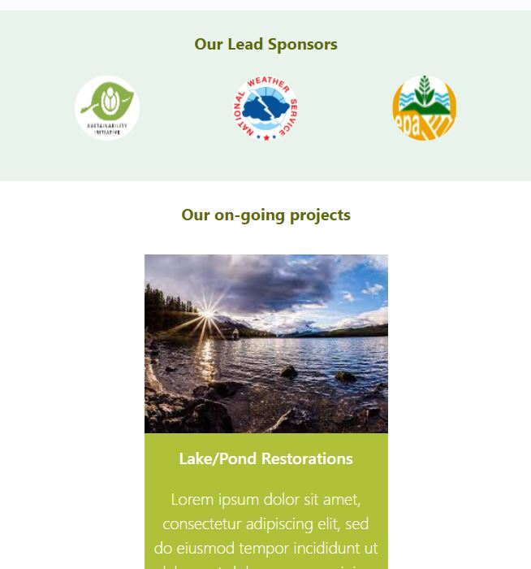

# Thendral 
This is an organisation which concentrates solely on development of the Environment. We undertake lots of social works as such Lake restorations, Afforestation etc. Thendral was founded in an attempt to bring awareness to people who are neglecting the detoriating climate and environment. And to provide a space where people who have realized this to collaborate and work on improving it.

[**click here to view the component**](https://harishkumaaran.github.io/Thendral/)
&nbsp;

# screenshots 

&nbsp;

# Technology Stack
- HTML
- CSS
- Tailwind CSS

&nbsp;

# Credits
- Thendral is done as a part of my Front end curriculum at Aekam Labs, Coimbatore.

